# Formancy Data

**Turn your existing database into forms that fit your application.**

A self-hosted module for [formancy](https://github.com/sharkysan/formancy.ai)
that discovers an existing relational database, generates an editable formancy
form from it, resolves foreign-key lookups under your application's own
authorisation, and loads and saves records. PostgreSQL and Microsoft SQL Server
in the first release, through one database-neutral core and two adapters. The
published form renders in Angular or React with the formancy renderers and
operates without any AI dependency.

<!-- generated by scripts/pictures/readme.mjs from scripts/pictures/scenes.json: hero; do not edit -->

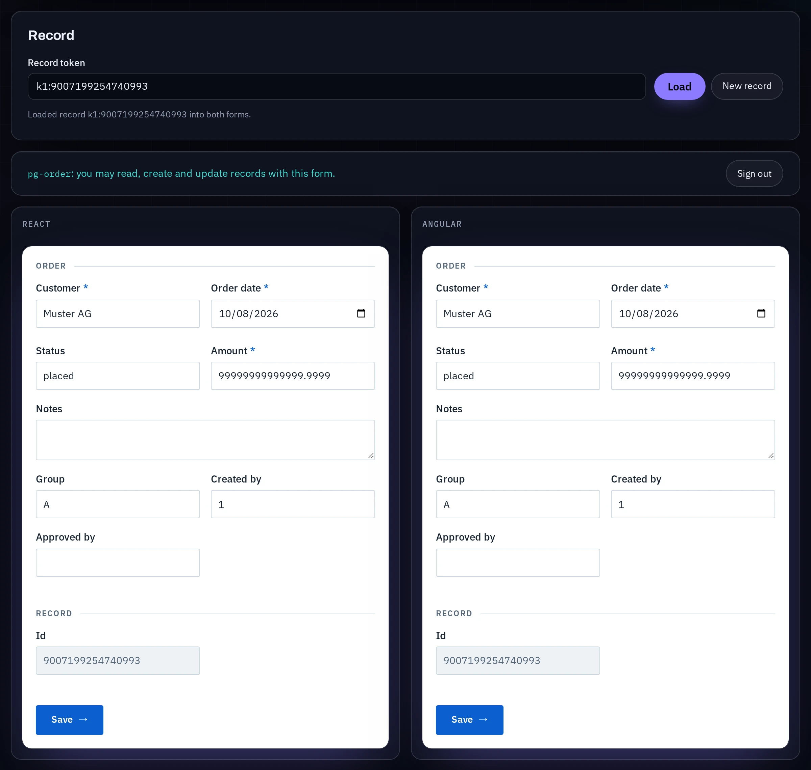

*`pg-order`, generated from `sales.order` on PostgreSQL as the order form's own account and published through the administrator plane with the getting-started guide's request and policy, drawn by `@formancy/react` and `@formancy/angular` from one definition through `@formancy/data-client`. The order is the fixture's edge case: its id, “9007199254740993”, is 2^53+1, which a JavaScript number reads back as …992, and its amount, “99999999999999.9999”, is the largest `numeric(18,4)` holds. Both panes show both digit for digit, because exact values travel as strings ([0008](./docs/decisions/0008-exact-values-travel-as-strings.md)).*

Every picture in this README is taken by `pnpm pictures` from the built pages and the real data server, and the browser job fails when one of them shows text the page no longer shows ([how, and what nothing checks](./docs/images/README.md)).

<!-- end generated -->

> **Status: in development, nothing released.** Both adapters discover a real
> database, including what a restricted account cannot see, and the same model
> checks both. A form can be generated from a snapshot; values are checked
> exactly, and a snapshot says what its account may do with every column and
> whether row-level security applies to it, which generation and drift review
> now read. Both adapters answer lookups and records; the server publishes forms
> and serves them over HTTP, asking the policy every time and auditing every
> request that reaches a route of either plane, publishing and restoring
> included, and one suite runs that whole journey on both engines. A row
> filter, a lookup label and a refusal mean the same on both engines, and a
> shared parity schema holds each adapter to one expectation per case. A page
> renders generated forms in React and Angular side by side, and the studio
> walks an administrator from a connection to a published form and its drift.
> A published form keeps the presentation chosen over its generated base, and
> the server regenerates it after a change to the database, carrying that
> presentation by what each field stands for, and restores an older version
> when the database still fits it — proved on both engines — and the studio
> does both from its Drift step. A host renders, loads, saves and searches a
> published form in both renderers through `@formancy/data-client`, and the
> host page does so against both engines in its suite. A save whose answer is
> lost says it may have been saved, all the way to the host page, which holds
> a create until it is checked or the person confirms; on both engines a test
> drops the database's answer after the commit and fails if anything sends the
> write again. Chromium sends such a write again on its own, and the server
> answers that copy with the first one's answer, within one process; the
> browser gate measures it. From an empty machine with Docker and git,
> `docker compose --profile stack up` runs both databases with the sample
> fixture, the server, and the studio and the host page behind one proxy,
> and a CI job runs [the guide](./docs/getting-started.md) that says how, as
> written, on both engines. Every CI run ends in a report of what it was
> tested on -- each server's own version, the dependencies the suites
> loaded, every shared case on both engines -- which a release checks, signs
> and attaches.
> `CHANGELOG.md` says what each step found.

## Licence, in one table

Source-available, **not** open source. The formancy engine, renderers, builder
and backend this module builds on stay Apache-2.0; this module does not.

| Use | Terms |
| --- | --- |
| Read the source and fork the repository | Free |
| Evaluate, develop and test — including in companies | Free |
| Run in production, internally or customer-facing | Paid licence |
| Redistribute inside another software product | Separate commercial agreement |
| Customer data and generated form definitions | Remain the customer's |

[`LICENSE.md`](./LICENSE.md) has the terms. It is a draft awaiting legal
review and says so at the top. Why a paid module exists beside an Apache-2.0
project, and why in a repository of its own, is decision
[0001](./docs/decisions/0001-a-paid-module-in-its-own-repository.md).

## Packages

| Package | What it is |
| --- | --- |
| `@formancy/data-core` | The database-neutral port and metadata contract: what discovery returns, including what it could not see. No driver, no HTTP, no Node. |
| `@formancy/data-postgres` | The PostgreSQL adapter, on the `postgres` driver. |
| `@formancy/data-sqlserver` | The SQL Server adapter, on `mssql` over `tedious` — pure JavaScript, no ODBC. |
| `@formancy/data-client` | The browser's side of the runtime plane: a `fetch`-based client for a published form's definition, records and lookups, and the option sources both formancy renderers take. Source-available, framework-neutral, no Node. |
| `@formancy/data-server` | The server: configuration store, host identity, the administrator and runtime planes over HTTP, the audit trail, and the composition root that starts them from configuration. Fastify, like formancy's. |
| `@formancy/data-fixtures` | Private test support: one business model for both engines, a restricted reader, and the comparator both adapters answer to. Never published. |

## What it is tested on

<!-- generated by scripts/release-report/readme.mjs; do not edit -->

| | Tested with | Declared as |
| --- | --- | --- |
| **PostgreSQL** | `postgres:17-alpine`, unless a test names another image |  |
| **SQL Server** | `mcr.microsoft.com/mssql/server:2022-latest`, unless a test names another image |  |
| `postgres`, by `@formancy/data-postgres` | 3.4.9 | `^3.4.9` |
| `@fastify/rate-limit`, by `@formancy/data-server` | 11.2.0 | `^11.2.0` |
| `fastify`, by `@formancy/data-server` | 5.12.5 | `^5.12.5` |
| `jose`, by `@formancy/data-server` | 6.2.12 | `^6.2.12` |
| `@types/mssql`, by `@formancy/data-sqlserver` | 12.3.0 | `^12.3.0` |
| `mssql`, by `@formancy/data-sqlserver` | 12.7.4 | `^12.0.0` |
| `tedious`, under `mssql` | 20.3.3 | `^19.2.2 \|\| ^20.0.0`, by `mssql` |
| `@formancy/angular` | 0.3.0 | `0.3.0` |
| `@formancy/builder-core` | 0.3.0 | `0.3.0` |
| `@formancy/conformance` | 0.3.0 | `0.3.0` |
| `@formancy/core` | 0.3.0 | `0.3.0` |
| `@formancy/expressions` (transitive) | 0.3.0 |  |
| `@formancy/react` | 0.3.0 | `0.3.0` |
| `@formancy/spec` | 0.3.0 | `0.3.0` |
| `@formancy/themes` | 0.3.0 | `0.3.0` |
| Node, the workspace |  | `>=22.12.0` |
| Node, the server image | `node:22.12-alpine`, every stage |  |
| Node, CI | 22 |  |
| pnpm | 12.4.2, through corepack | `pnpm@12.4.2`, the root's `packageManager` |
| Chromium | 153.0.8010.12, the chromium-headless-shell Playwright 1.63.0 pins (revision 1243) |  |
| `jsdom` | 30.1.2 |  |
| `react` | 19.3.0 |  |
| `@angular/core` | 22.2.1 |  |
| `axe-core` | 4.14.0 |  |
| `typescript` | 6.0.3 |  |
| `vitest` | 5.0.3 |  |
| `testcontainers` | 12.2.0 |  |

What a run actually answered — each server’s own version and image digest, every other image a test started, the Node and Chromium it launched — is in the report every CI run produces and every release attaches, signed.

<!-- end generated -->

## Examples

`apps/examples` is a private page, never published, that shows a generated form
the way the people filling it in will see it — under both renderers at once.

```bash
pnpm build
pnpm --filter @formancy/data-examples dev        # http://localhost:4391
```

It reads a snapshot of the shared fixture, checks it against its fingerprint,
runs `generateForm` **in the browser** for `sales.order` and `sales.customer`,
and renders each with the released `@formancy/react` and `@formancy/angular`
side by side, on white paper in the Blueprint theme, with the generator's notes
— inferred, excluded, read-only, blocked — beside each. Its suite holds the two
renderers to the same fields by accessible name and the same error codes
([0021](./docs/decisions/0021-generated-forms-preview-in-both-frameworks.md)).

<!-- generated by scripts/pictures/readme.mjs from scripts/pictures/scenes.json: examples; do not edit -->

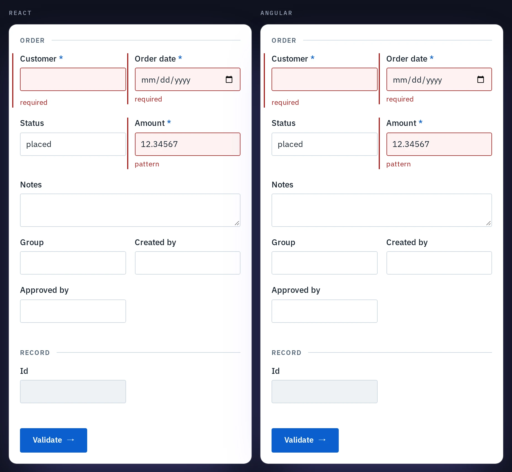

*The examples page runs the generator in the browser over a snapshot captured from PostgreSQL, with no server, and renders `sales.order` with both renderers. An amount with five decimals for a `numeric(18,4)` column is refused in both with the same code, “pattern”, and the empty required fields with “required” ([0021](./docs/decisions/0021-generated-forms-preview-in-both-frameworks.md)).*

<!-- end generated -->

What the suite cannot see, because jsdom performs no layout, a browser gate
measures in Chromium: no sideways scroll down to 320 pixels, the keyboard path
through the skip link into the first preview, and colour contrast and target
size, clean and after a failed submit.

```bash
pnpm --filter @formancy/data-examples exec playwright install chromium   # once per machine
pnpm test:browser                                                        # builds the apps, then measures them
```

The snapshot is captured from a real PostgreSQL container, never written by
hand. After a change to the fixture, with Docker running:

```bash
pnpm build
pnpm --filter @formancy/data-examples snapshot
```

and commit `apps/examples/src/fixture-snapshot.json` and
`fixture-customers.json`. The suite compares the committed snapshot with the
fixture model and fails where they disagree, and refuses a snapshot edited by
hand. The customer lookup is an in-memory source over the captured customers,
because this page has no server, and the page says so; a host gets the list
from the runtime plane, as the host page below shows.

## Studio

`apps/studio` is the administrator's application, private and never
published: sign in with a host token, connect, choose a root table, generate,
write the policy, arrange labels, preview, publish, and review drift. It
speaks only to the server's administrator plane and `/v1/whoami`
([0024](./docs/decisions/0024-the-studio-speaks-only-the-admin-plane.md)).
The plane also regenerates a published form from the database as it is now,
keeping the labels, order and full width chosen over the generated base and
saying what it could not keep, and restores an older version when drift
against it blocks nothing
([0030](./docs/decisions/0030-presentation-is-a-patch-over-the-generated-base.md)).
The studio does both from the Drift step: it shows what a regeneration could
not carry, with a choice where one exists, carries a draft's presentation
through the Policy step's "Generate again", holds publishing until each key
that now names another column has its grants kept or removed, and restores
an older version.

<!-- generated by scripts/pictures/readme.mjs from scripts/pictures/scenes.json: studio; do not edit -->

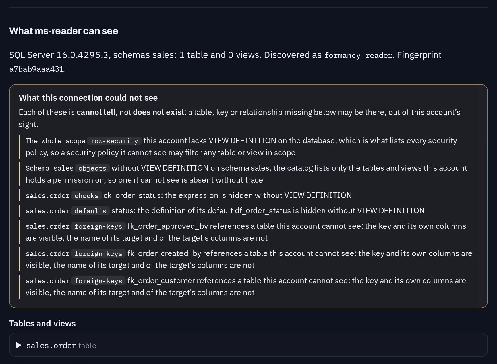

**Step 1, Connect.** *On SQL Server, as an account without VIEW DEFINITION. What the catalog hid from it comes first, each gap “cannot tell”, not “does not exist”, so a table or key missing below is never taken as absent ([0004](./docs/decisions/0004-a-snapshot-says-what-it-could-not-see.md), [0007](./docs/decisions/0007-sqlserver-discovery-and-what-it-hides.md)).*

<details>
<summary>More: Choose</summary>

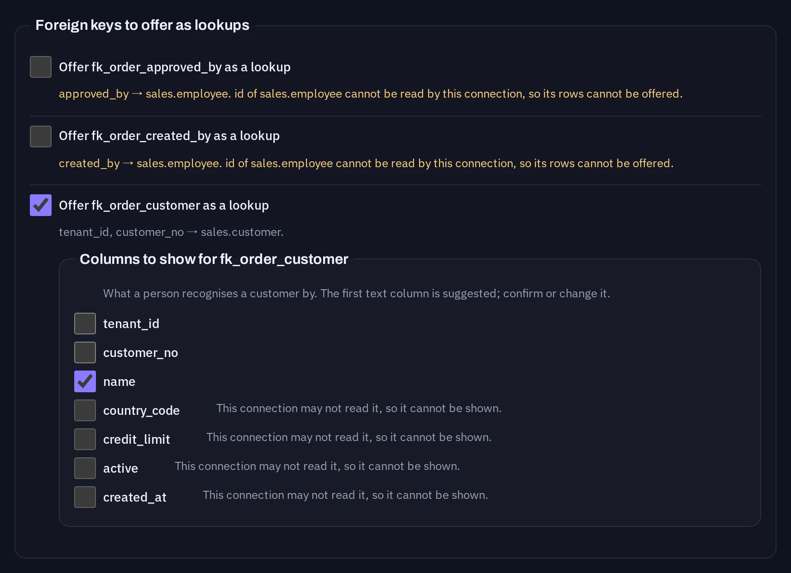

**Step 2, Choose.** *As the order form's own account. A foreign key is offered as a lookup only where this account may read its target: `approved_by` and `created_by` point at `sales.employee`, whose rows “cannot be offered”, and the customer columns it may not read “cannot be shown” ([0027](./docs/decisions/0027-a-snapshot-says-what-its-account-may-do.md)).*

</details>

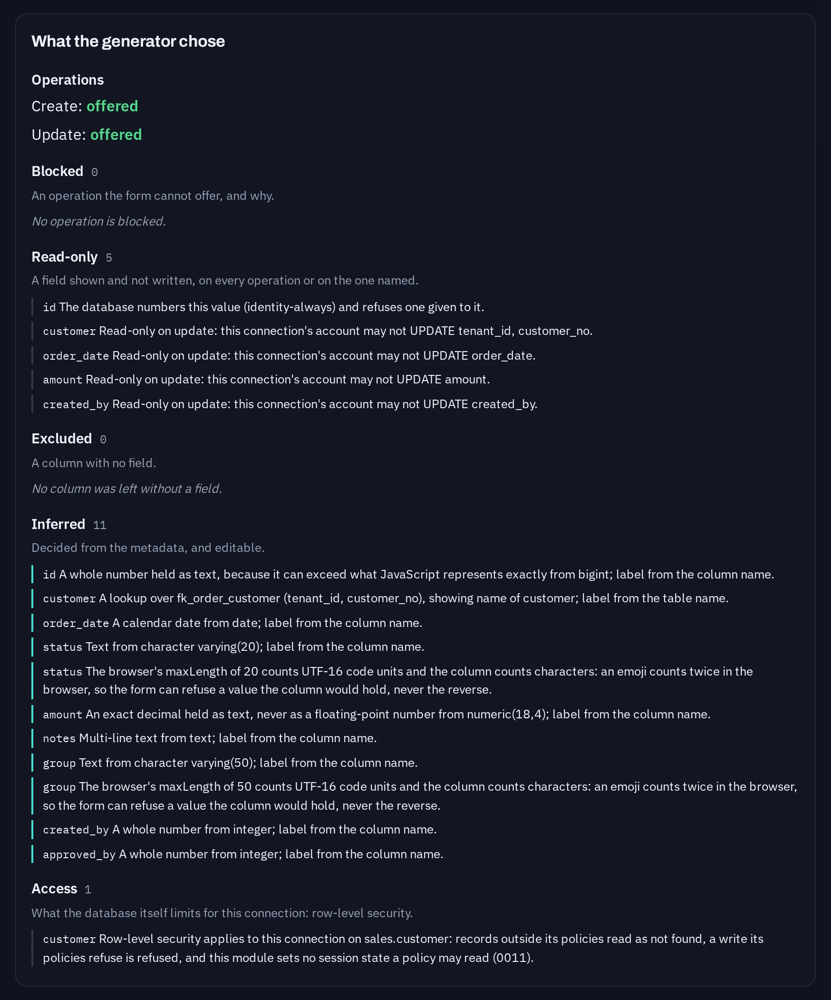

**Step 3, Generate.** *The generator says what it chose and what it refused, kind by kind, from what this account may do: a column it may not update is “Read-only on update”, and “Row-level security applies” to it on `sales.customer`, named as the database's own limit ([0009](./docs/decisions/0009-generation-is-deterministic-and-says-what-it-chose.md), [0027](./docs/decisions/0027-a-snapshot-says-what-its-account-may-do.md)).*

<details>
<summary>More: Policy, Presentation, Preview, A conflicting publish</summary>

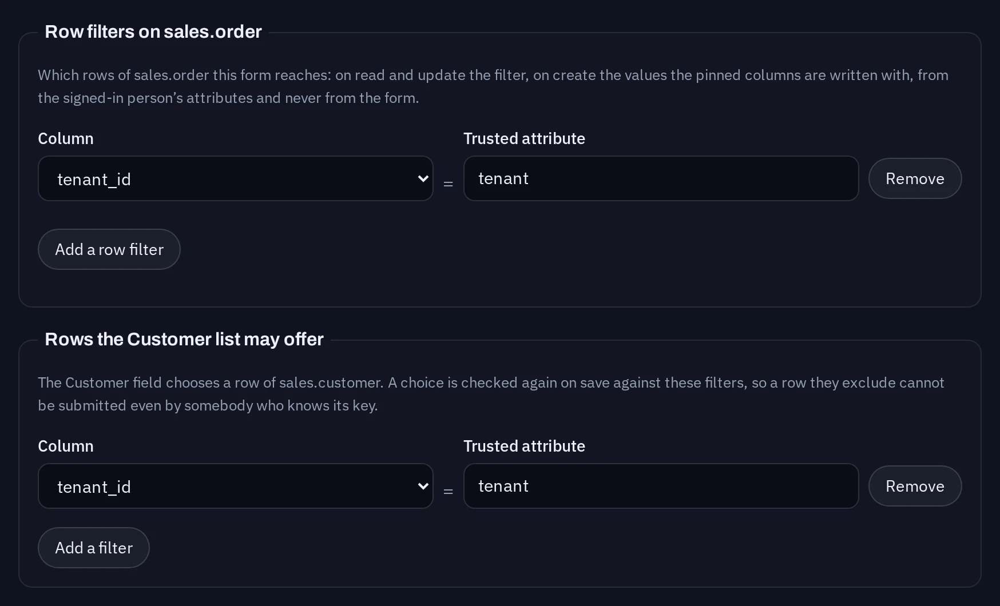

**Step 4, Policy.** *The tenant pin becomes a row filter on the orders this form reaches and on the customers its list may offer, taken from the signed-in person's attributes “and never from the form”; a customer outside the filter is refused on save “even by somebody who knows its key” ([0011](./docs/decisions/0011-every-operation-carries-a-trusted-policy-context.md)).*

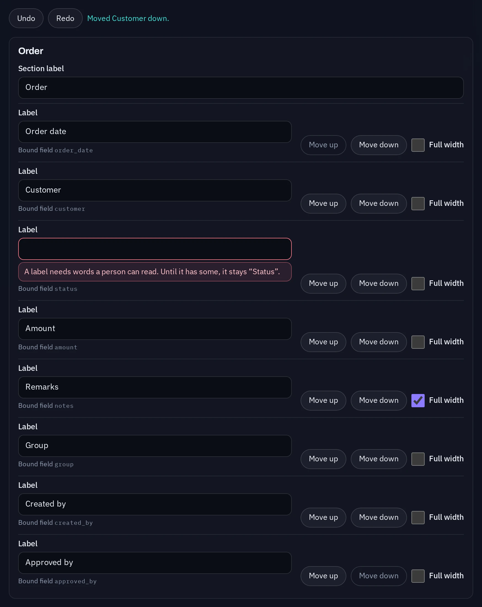

**Step 5, Presentation.** *Labels, order and width are a patch over the generated form: every row names the column it is bound to, nothing here adds, removes or renames a field, and an empty label is refused: “A label needs words a person can read.” ([0030](./docs/decisions/0030-presentation-is-a-patch-over-the-generated-base.md)).*

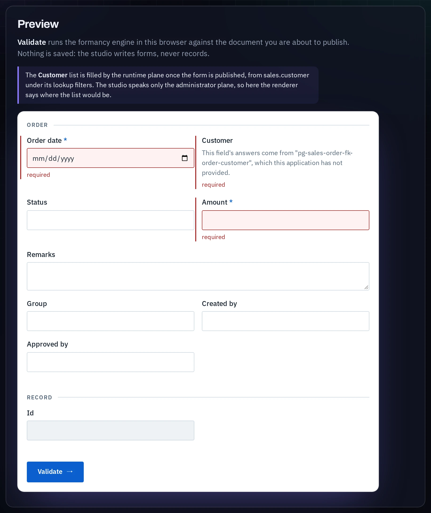

**Step 6, Preview.** *The form as the people filling it in will see it, on white paper in the Blueprint theme and checked by the released engine; the studio's browser gate fails if any rule of the studio's own stylesheet selects an element on the paper. The Customer list is filled only by the runtime plane, so “the renderer says where the list would be”.*

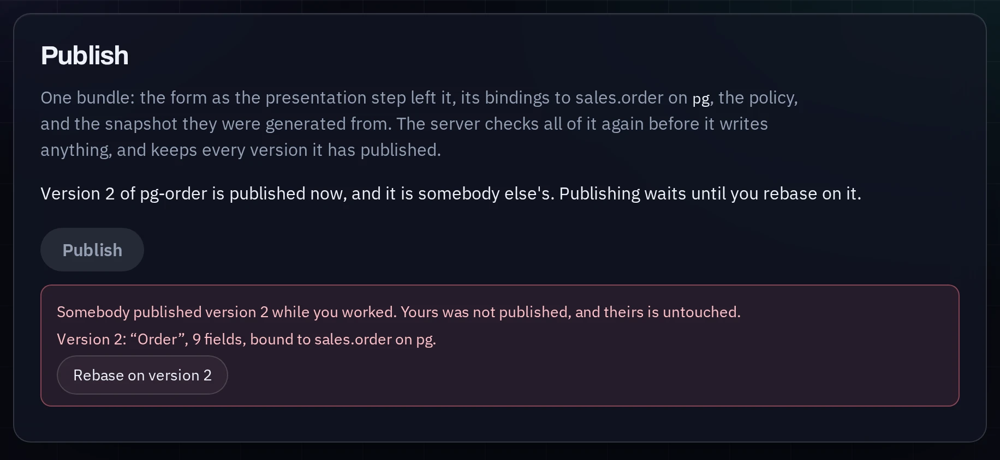

**Step 7, Publish.** *Another administrator, grace, published version 2 while ada worked; the capture script sends grace's request to the same server. Nothing is overwritten: “Yours was not published, and theirs is untouched.” The step says which version is published now, and “Publishing waits until you rebase on it.” ([0013](./docs/decisions/0013-published-configuration-is-files-with-link-based-swap.md)).*

</details>

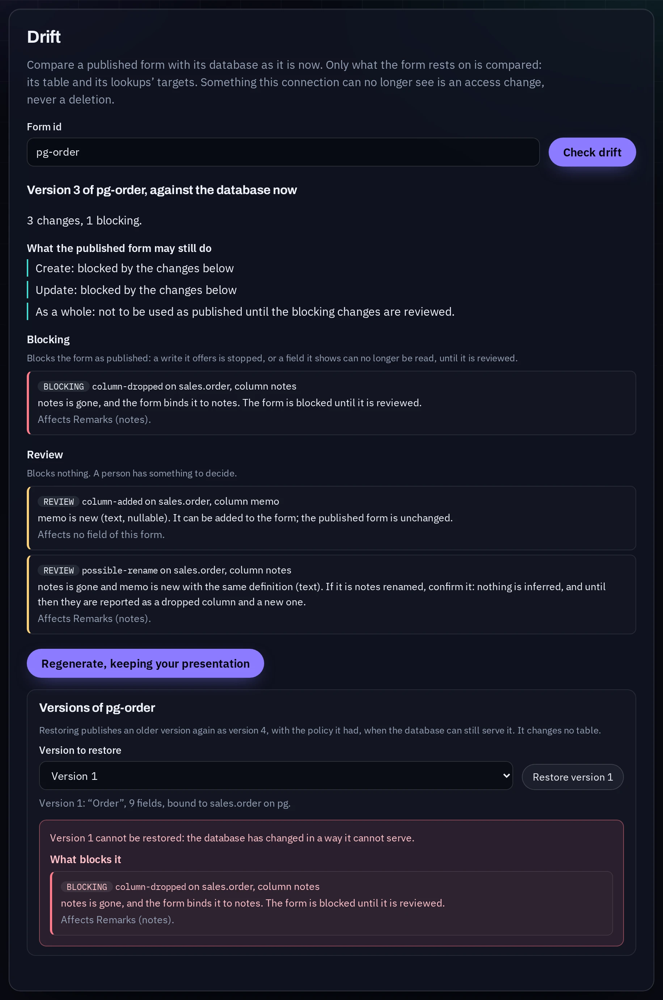

**Step 8, Drift.** *After the capture script renamed `notes` to `memo` in the captured snapshot, which is what discovery reports after a column is renamed in the database, on both engines. The published form may not be used until the change is reviewed, the rename is a “possible-rename” for a person to confirm and not a guess, and restoring version 1, which still binds `notes`, is refused with what blocks it: “Version 1 cannot be restored: the database has changed in a way it cannot serve.” ([0010](./docs/decisions/0010-drift-is-classified-against-the-bindings.md), [0030](./docs/decisions/0030-presentation-is-a-patch-over-the-generated-base.md)).*

<details>
<summary>More: Regenerated, Carried, Restored</summary>

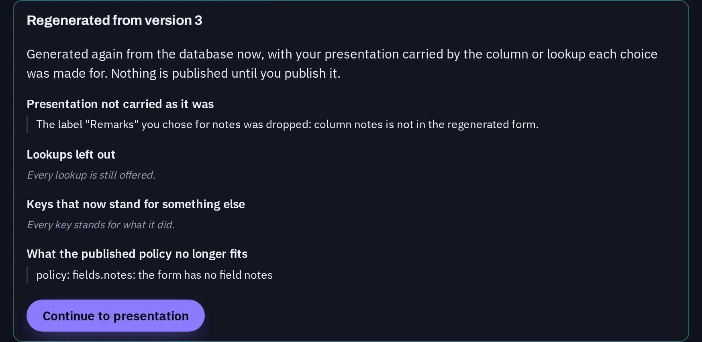

*Regenerated from the database as it is now, keeping the presentation, and saying before anything is published what it could not carry: the label chosen for `notes`, and the policy entry that names it. “Nothing is published until you publish it.”*

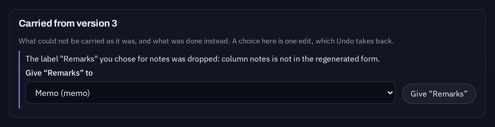

*Back in Presentation, the dropped label is offered to the new column as one edit, “which Undo takes back”; nothing carries it by guessing that `memo` is `notes`.*

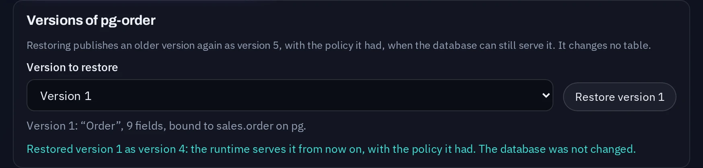

*Once the database fits version 1 again, it is restored as the next version with the policy it had: “The database was not changed.”*

</details>

<!-- end generated -->

```bash
pnpm build
FORMANCY_DATA_SERVER=http://127.0.0.1:4390 pnpm --filter @formancy/data-studio dev   # http://localhost:4392
```

The server sends no CORS headers, so the studio is served from the server's
origin: in development Vite proxies `/v1` to `FORMANCY_DATA_SERVER`, and in a
deployment one reverse proxy serves `apps/studio/dist` and `/v1` together. In
the composed stack that proxy is [`deploy/web/nginx.conf`](./deploy/web/nginx.conf),
which serves the studio at `/studio/`, built with that base, and is the shape
a deployment's own proxy copies; [the getting-started guide](./docs/getting-started.md)
runs it ([0032](./docs/decisions/0032-a-clean-install-is-the-composed-stack-and-ci-runs-its-guide.md)).
The token is held in the tab's memory only; reloading the page signs out. The
server needs its administrator plane turned on — a store, an allowlist and
`FORMANCY_DATA_ADMIN_ROLES`, as
[its README](./packages/data-server/README.md) says; against a server without
one, the studio says so at sign-in.

Its suite runs the real server in the test — `createDataServer` with a fake
connection registry over snapshots captured from the shared fixture, as every
account `apps/studio/scripts/capture-snapshots.mjs` captures — behind a fake
`fetch`, so a change to a response shape fails the studio's tests.
`pnpm test:browser` walks the whole journey in Chromium against the same
server. After a change to the fixture, with Docker running:

```bash
pnpm build
pnpm --filter @formancy/data-studio snapshot
```

and commit the files under `apps/studio/src/fixtures/`.

## Host example

`apps/host` is a host application's page, private and never published: one
published form, under `@formancy/react` and `@formancy/angular` side by side,
loaded, edited, saved and searched through `@formancy/data-client`. It speaks
only to the server's runtime plane
([0029](./docs/decisions/0029-a-host-renders-a-published-form-through-one-client.md)).

```bash
pnpm build
FORMANCY_DATA_SERVER=http://127.0.0.1:4390 pnpm --filter @formancy/data-host dev   # http://localhost:4393
```

Open a form with a host token and its id, load a record by its token into both
panes or start a new one, and save from either. Each pane keeps its own draft
and version, so loading one record in both, saving in one and then in the other
is the stale case: the second pane keeps what was typed, says so, and offers to
load the saved record. A selection the server refuses is said on the field.
The form stays editable while a save is out: what is typed meanwhile is kept
and said to be unsaved, a second press sends nothing and says so, and an
answer that arrives after Load or New is said on the pane's line.
In a real host the application's own session supplies the token; the page asks
for one because it has none, holds it in memory only, and forgets it on a
reload. As with the studio, the page is served from the server's origin: in
development Vite proxies `/v1`, and in the composed stack the same
`deploy/web/nginx.conf` serves it at `/host/`, which the getting-started
guide's section 5 uses.

<!-- generated by scripts/pictures/readme.mjs from scripts/pictures/scenes.json: host; do not edit -->

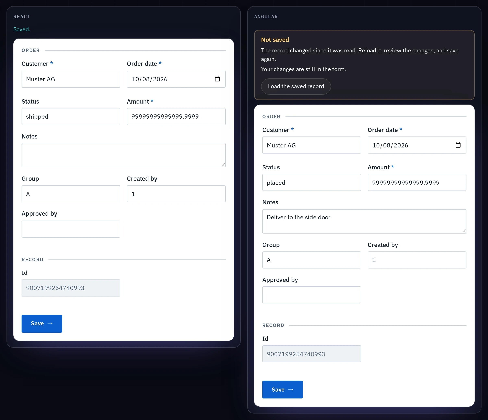

*Two drafts of one record. React saved first; Angular's save, made against the version it read, is refused as stale instead of overwriting it: “Your changes are still in the form.”, with a button to “Load the saved record” ([0015](./docs/decisions/0015-a-record-operation-is-one-guarded-statement.md)).*

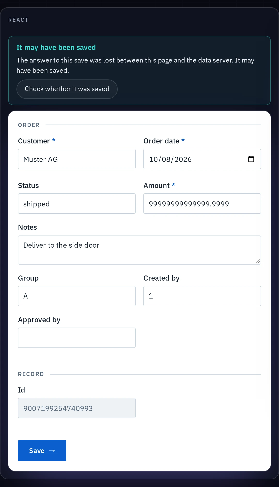

*A save whose answer was lost after the server stored it: the capture script lets the server store it and then tells the page the connection was reset. The page cannot know whether it was saved, so it says so, offers to check, and holds the save; nothing sends it again ([0031](./docs/decisions/0031-an-answer-lost-after-a-write-is-unknown.md)).*

<details>
<summary>More: The customer typeahead, A refused choice, Another tenant's record</summary>

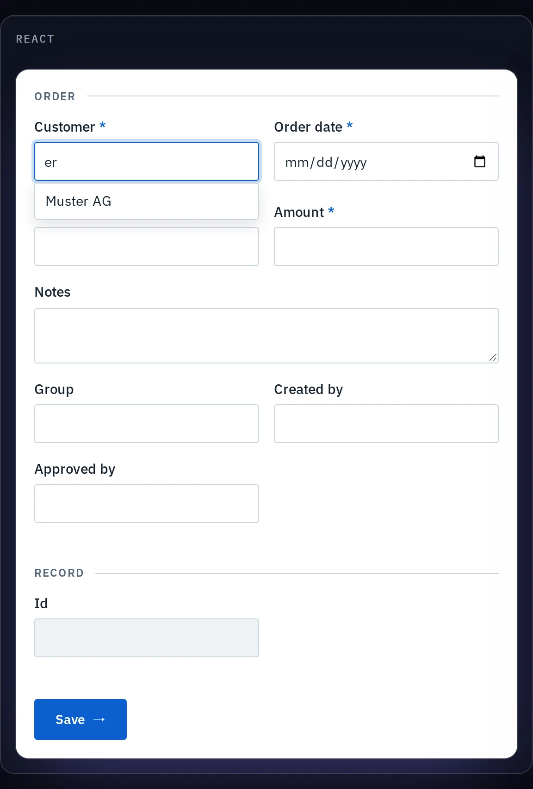

*The customer field is a typeahead the host page draws over the published lookup. As clara, a clerk of tenant 1, types, the page asks the runtime plane as her, and the server answers with the rows she may choose: “Muster AG”, and not tenant 2's Other Tenant GmbH, which matches too and has the same customer number. Each option travels under a token that is a reference, not a permission ([0012](./docs/decisions/0012-a-lookup-token-is-a-reference-not-a-permission.md)).*

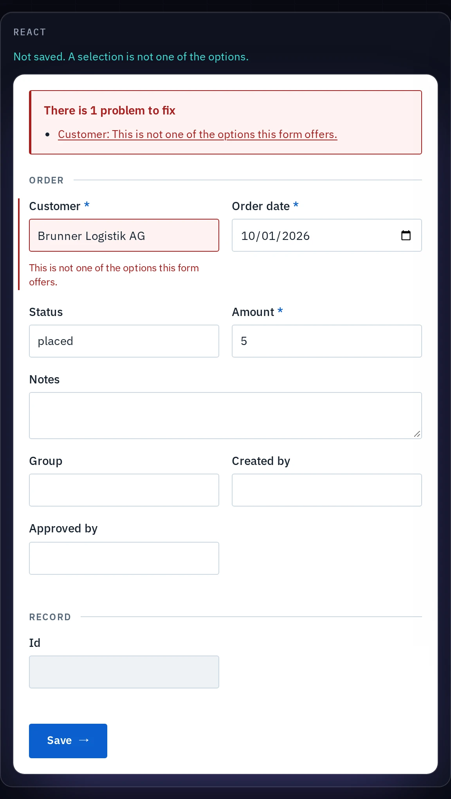

*A customer chosen from the list and deleted by somebody else before Save; the capture script inserts and deletes it through the database's owner. The server checks the choice again when the order is saved and refuses it on the field: “This is not one of the options this form offers.”*

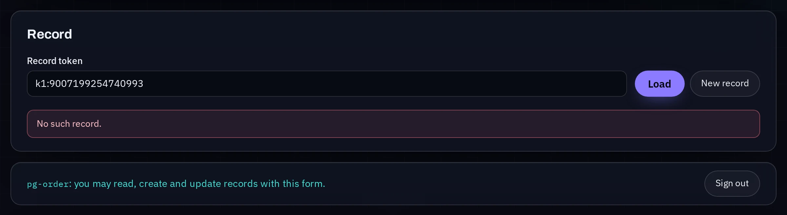

*otto, a clerk of tenant 2, may read records with this form; with tenant 1's record token he is told “No such record.”, the answer a token that names no record gets, so the page learns nothing about another tenant's orders ([0022](./docs/decisions/0022-the-runtime-plane-asks-the-policy-every-time.md)).*

</details>

<!-- end generated -->

Its suites run the real server against PostgreSQL and SQL Server through the
real drivers, with literal tokens and a `fetch` that goes through
`app.inject`. `pnpm test:browser` measures the page in Chromium against the
real server on PostgreSQL, which needs Docker.

## How it relates to formancy.ai

This repository **depends on** the released `@formancy/*` packages and copies
none of their code ([0002](./docs/decisions/0002-depend-on-upstream-never-copy-it.md)).
Upstream versions are exact, and a guard refuses a range or a path. A generic
improvement the module needs — an exact-decimal field type, say — goes upstream
through formancy's own contribution rules rather than being patched here.

## Development

Node and pnpm at the versions *What it is tested on* names -- pnpm through
corepack, which runs the one the root's `packageManager` pins -- and Docker
for the tests, whose version each run's report names for every job.

```bash
corepack enable pnpm
pnpm install
pnpm build
pnpm test        # starts the databases *What it is tested on* names, through testcontainers
```

There is no mocked driver and no `--skip-db` flag. Database behaviour is proved
against real servers or it is not proved
([0003](./docs/decisions/0003-real-databases-in-every-test-run.md)). The first
run pulls the SQL Server image, which is about a gigabyte and a half.

`docker compose up -d` gives you both databases on loopback for a shell or a
client; the tests do not use it. Their passwords are generated into a Docker
volume on the first start, not typed into a `.env`: read one with
`docker compose exec sqlserver cat /run/formancy-secrets/mssql-sa-password`
(or `postgres-owner-password` on `postgres`). `.env.example` lists the port
overrides, which are all a `.env` may still hold. A database volume made
before the secrets volume existed holds the old password and needs
`docker compose down -v`. `compose.yaml` needs the Compose release the
guide's section 0 names. With `--profile stack` the same file runs the whole
product, as [`docs/getting-started.md`](./docs/getting-started.md) walks
through.

The gates are [`.github/workflows/gates.yml`](./.github/workflows/gates.yml),
which CI runs on every pull request and a release runs before it publishes:
`pnpm build`, `pnpm typecheck`, `pnpm check:pkg`,
`node scripts/verify-licenses.mjs` and `pnpm test:repo` in one job; each
package's `test:coverage` in a job of its own; in jobs of their own
`pnpm test:e2e:install`, `pnpm test:browser`, the server image, and
`pnpm test:getting-started`, which runs the guide from a clean checkout with
Node and Docker alone, with the runner's Compose and again with the oldest
the guide names. The last job builds [the release report](./docs/release/README.md)
from what every other job found, and fails the run on anything wrong in it
([0035](./docs/decisions/0035-a-release-report-is-derived-from-the-run-that-gated-it.md)).
[`CLAUDE.md`](./CLAUDE.md) says what each is for and what the bar is.

The pictures in this README are taken by `pnpm pictures`, in Chromium, from
the built pages against the real data server: run `pnpm build` first, and it
needs Chromium, installed as under *Examples*, the network for Google Fonts,
and Docker for the host page's. By default it walks every scene and retakes
only the pictures whose text changed, or whose file is missing or not the one
recorded; `--scene <id>` retakes the ones it names, `--all` every one, and
`--review <dir>` also writes each new picture, decoded to PNG, into a
directory outside the repository to look at. Every
picture is taken on one look — platform, Playwright, Chromium and the fonts'
versions — and a picture taken on another is refused until `pnpm pictures
--all` retakes them all. Each app's `pnpm test:browser` runs its
`pictures.mjs --check`, which walks the same states with the fonts refused
and fails when a pictured element says something else
([0038](./docs/decisions/0038-readme-pictures-are-taken-by-a-script-and-held-to-the-text-they-show.md)).

## Documents

- [`docs/getting-started.md`](./docs/getting-started.md) — from an empty machine with Docker and git to a published form on both engines; CI runs it as written.
- [`docs/decisions/`](./docs/decisions/README.md) — every decision somebody could helpfully undo, with what verifies it.
- [`docs/release/`](./docs/release/README.md) — the report every CI run and every release builds of what it was tested on, the register of the limitations the decisions state, and the release gates' evidence.
- [`docs/images/README.md`](./docs/images/README.md) — how the README's pictures are taken, and what holds them and what does not.
- [`CHANGELOG.md`](./CHANGELOG.md) — what changed and why.
- [`CONTRIBUTING.md`](./CONTRIBUTING.md) and [`CLA.md`](./CLA.md) — contributions are taken under a CLA, checked on every pull request.
- [`SECURITY.md`](./SECURITY.md) — how to report a vulnerability, and what this product considers highest risk.
- [`RELEASING.md`](./RELEASING.md) — releases are cut by the workflow, rehearsed first, with provenance, a signed SBOM and the signed report of the run that gated them.
